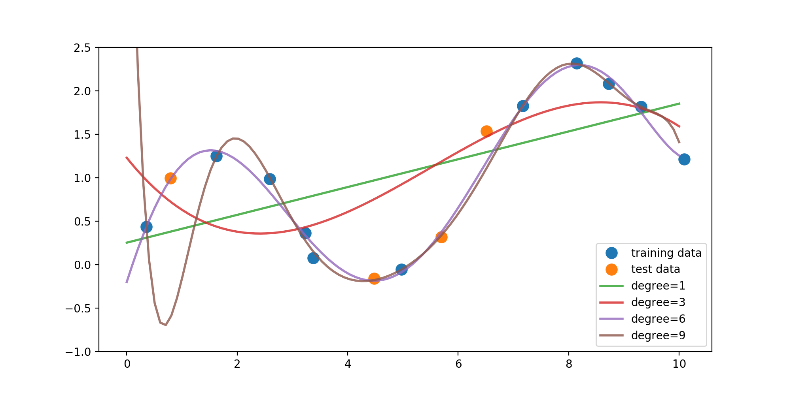

```python
# RUN THIS COMMAND ONLY IF YOU USE GOOGLE COLAB.
from google.colab import drive
drive.mount('/content/drive')
```


```python
# RUN THIS COMMAND ONLY IF YOU USE GOOGLE COLAB.
%cd drive/MyDrive/TechLabs/04_Machine\ Learning
```


```python
# IMPORT THESE FIRST.
import numpy as np
import pandas as pd
import seaborn as sn
import matplotlib.pyplot as plt
from matplotlib.colors import ListedColormap
from sklearn.model_selection import train_test_split
from sklearn.neighbors import KNeighborsClassifier, KNeighborsRegressor
from sklearn.preprocessing import MinMaxScaler, PolynomialFeatures
from sklearn.datasets import (make_classification, make_blobs, load_breast_cancer, make_regression, make_friedman1,
                              load_iris)
from sklearn.linear_model import LinearRegression, Ridge, Lasso, LogisticRegression
from sklearn.svm import SVC, LinearSVC
from sklearn.tree import DecisionTreeClassifier, plot_tree
from sklearn.model_selection import cross_val_score, validation_curve, train_test_split
from data.adspy_shared_utilities import (load_crime_dataset, plot_two_class_knn, 
                                         plot_class_regions_for_classifier_subplot, 
                                         plot_class_regions_for_classifier,
                                         plot_feature_importances)
```

# Chapter 02 - Supervised Machine Learning
### Hey Techie,   
Welcome to the second notebook of this Machine Learning tutorial series. Today's videos introduce you to the concepts and different algorithms of supervised machine learning.   
This notebook is designed to allow you to take notes as you watch each video and learn along the code discussed in the videos. At the end of the notebook, you will find practice tasks that you can solve on your own and compare to our sample solution.   
After auditing the course, you may find the respective materials here: https://www.coursera.org/learn/python-machine-learning/home/week/2
#### Have fun! :-)   
*Video length in total*: 160 minutes   
*Self-study time*: 160 minutes   
*Total*: **320 minutes**   
#### Credits
Applied Machine Learning in Python, University of Michigan (Coursera), https://www.coursera.org/learn/python-machine-learning?specialization=data-science-python
<hr style="border:2px solid gray"> </hr>   
   
## Notes

* Take notes here.
    * And here.
* ...
* ...

<hr style="border:2px solid gray"> </hr>   
   
## Applied Machine Learning, Module 2:  Supervised Machine Learning

### Preamble and Review


```python
np.set_printoptions(precision=2)


fruits = pd.read_table('data/fruit_data_with_colors.txt')

feature_names_fruits = ['height', 'width', 'mass', 'color_score']
X_fruits = fruits[feature_names_fruits]
y_fruits = fruits['fruit_label']
target_names_fruits = ['apple', 'mandarin', 'orange', 'lemon']

X_fruits_2d = fruits[['height', 'width']]
y_fruits_2d = fruits['fruit_label']

X_train, X_test, y_train, y_test = train_test_split(X_fruits, y_fruits, random_state=0)

scaler = MinMaxScaler()
X_train_scaled = scaler.fit_transform(X_train)
# we must apply the scaling to the test set that we computed for the training set
X_test_scaled = scaler.transform(X_test)

knn = KNeighborsClassifier(n_neighbors = 5)
knn.fit(X_train_scaled, y_train)
print('Accuracy of K-NN classifier on training set: {:.2f}'
     .format(knn.score(X_train_scaled, y_train)))
print('Accuracy of K-NN classifier on test set: {:.2f}'
     .format(knn.score(X_test_scaled, y_test)))

example_fruit = [[5.5, 2.2, 10, 0.70]]
example_fruit_scaled = scaler.transform(example_fruit)
print('Predicted fruit type for ', example_fruit, ' is ', 
          target_names_fruits[knn.predict(example_fruit_scaled)[0]-1])
```

### Datasets


```python
cmap_bold = ListedColormap(['#FFFF00', '#00FF00', '#0000FF','#000000'])


# synthetic dataset for simple regression
plt.figure()
plt.title('Sample regression problem with one input variable')
X_R1, y_R1 = make_regression(n_samples = 100, n_features=1,
                            n_informative=1, bias = 150.0,
                            noise = 30, random_state=0)
plt.scatter(X_R1, y_R1, marker= 'o', s=50)
plt.show()


# synthetic dataset for more complex regression
plt.figure()
plt.title('Complex regression problem with one input variable')
X_F1, y_F1 = make_friedman1(n_samples = 100,
                           n_features = 7, random_state=0)

plt.scatter(X_F1[:, 2], y_F1, marker= 'o', s=50)
plt.show()

# synthetic dataset for classification (binary) 
plt.figure()
plt.title('Sample binary classification problem with two informative features')
X_C2, y_C2 = make_classification(n_samples = 100, n_features=2,
                                n_redundant=0, n_informative=2,
                                n_clusters_per_class=1, flip_y = 0.1,
                                class_sep = 0.5, random_state=0)
plt.scatter(X_C2[:, 0], X_C2[:, 1], c=y_C2,
           marker= 'o', s=50, cmap=cmap_bold)
plt.show()


# more difficult synthetic dataset for classification (binary) 
# with classes that are not linearly separable
X_D2, y_D2 = make_blobs(n_samples = 100, n_features = 2, centers = 8,
                       cluster_std = 1.3, random_state = 4)
y_D2 = y_D2 % 2
plt.figure()
plt.title('Sample binary classification problem with non-linearly separable classes')
plt.scatter(X_D2[:,0], X_D2[:,1], c=y_D2,
           marker= 'o', s=50, cmap=cmap_bold)
plt.show()


# Breast cancer dataset for classification
cancer = load_breast_cancer()
(X_cancer, y_cancer) = load_breast_cancer(return_X_y = True)


# Communities and Crime dataset
(X_crime, y_crime) = load_crime_dataset()
```

### K-Nearest Neighbors

#### Classification


```python
X_train, X_test, y_train, y_test = train_test_split(X_C2, y_C2,
                                                   random_state=0)

plot_two_class_knn(X_train, y_train, 1, 'uniform', X_test, y_test)
plot_two_class_knn(X_train, y_train, 3, 'uniform', X_test, y_test)
plot_two_class_knn(X_train, y_train, 11, 'uniform', X_test, y_test)
```

#### Regression


```python
X_train, X_test, y_train, y_test = train_test_split(X_R1, y_R1, random_state = 0)

knnreg = KNeighborsRegressor(n_neighbors = 5).fit(X_train, y_train)

print(knnreg.predict(X_test))
print('R-squared test score: {:.3f}'
     .format(knnreg.score(X_test, y_test)))
```


```python
fig, subaxes = plt.subplots(1, 2, figsize=(8,4))
X_predict_input = np.linspace(-3, 3, 50).reshape(-1,1)
X_train, X_test, y_train, y_test = train_test_split(X_R1[0::5], y_R1[0::5], random_state = 0)

for thisaxis, K in zip(subaxes, [1, 3]):
    knnreg = KNeighborsRegressor(n_neighbors = K).fit(X_train, y_train)
    y_predict_output = knnreg.predict(X_predict_input)
    thisaxis.set_xlim([-2.5, 0.75])
    thisaxis.plot(X_predict_input, y_predict_output, '^', markersize = 10,
                 label='Predicted', alpha=0.8)
    thisaxis.plot(X_train, y_train, 'o', label='True Value', alpha=0.8)
    thisaxis.set_xlabel('Input feature')
    thisaxis.set_ylabel('Target value')
    thisaxis.set_title('KNN regression (K={})'.format(K))
    thisaxis.legend()
plt.tight_layout()
```

#### Regression model complexity as a function of K


```python
# plot k-NN regression on sample dataset for different values of K
fig, subaxes = plt.subplots(5, 1, figsize=(5,20))
X_predict_input = np.linspace(-3, 3, 500).reshape(-1,1)
X_train, X_test, y_train, y_test = train_test_split(X_R1, y_R1,
                                                   random_state = 0)

for thisaxis, K in zip(subaxes, [1, 3, 7, 15, 55]):
    knnreg = KNeighborsRegressor(n_neighbors = K).fit(X_train, y_train)
    y_predict_output = knnreg.predict(X_predict_input)
    train_score = knnreg.score(X_train, y_train)
    test_score = knnreg.score(X_test, y_test)
    thisaxis.plot(X_predict_input, y_predict_output)
    thisaxis.plot(X_train, y_train, 'o', alpha=0.9, label='Train')
    thisaxis.plot(X_test, y_test, '^', alpha=0.9, label='Test')
    thisaxis.set_xlabel('Input feature')
    thisaxis.set_ylabel('Target value')
    thisaxis.set_title('KNN Regression (K={})\n\
Train $R^2 = {:.3f}$,  Test $R^2 = {:.3f}$'
                      .format(K, train_score, test_score))
    thisaxis.legend()
    plt.tight_layout(pad=0.4, w_pad=0.5, h_pad=1.0)

```

### Linear models for regression

#### Linear regression


```python
X_train, X_test, y_train, y_test = train_test_split(X_R1, y_R1,
                                                   random_state = 0)
linreg = LinearRegression().fit(X_train, y_train)

print('linear model coeff (w): {}'
     .format(linreg.coef_))
print('linear model intercept (b): {:.3f}'
     .format(linreg.intercept_))
print('R-squared score (training): {:.3f}'
     .format(linreg.score(X_train, y_train)))
print('R-squared score (test): {:.3f}'
     .format(linreg.score(X_test, y_test)))
```

#### Linear regression: example plot 


```python
plt.figure(figsize=(5,4))
plt.scatter(X_R1, y_R1, marker= 'o', s=50, alpha=0.8)
plt.plot(X_R1, linreg.coef_ * X_R1 + linreg.intercept_, 'r-')
plt.title('Least-squares linear regression')
plt.xlabel('Feature value (x)')
plt.ylabel('Target value (y)')
plt.show()
```


```python
X_train, X_test, y_train, y_test = train_test_split(X_crime, y_crime,
                                                   random_state = 0)
linreg = LinearRegression().fit(X_train, y_train)

print('Crime dataset')
print('linear model intercept: {}'
     .format(linreg.intercept_))
print('linear model coeff:\n{}'
     .format(linreg.coef_))
print('R-squared score (training): {:.3f}'
     .format(linreg.score(X_train, y_train)))
print('R-squared score (test): {:.3f}'
     .format(linreg.score(X_test, y_test)))
```

#### Ridge regression


```python
X_train, X_test, y_train, y_test = train_test_split(X_crime, y_crime,
                                                   random_state = 0)

linridge = Ridge(alpha=20.0).fit(X_train, y_train)

print('Crime dataset')
print('ridge regression linear model intercept: {}'
     .format(linridge.intercept_))
print('ridge regression linear model coeff:\n{}'
     .format(linridge.coef_))
print('R-squared score (training): {:.3f}'
     .format(linridge.score(X_train, y_train)))
print('R-squared score (test): {:.3f}'
     .format(linridge.score(X_test, y_test)))
print('Number of non-zero features: {}'
     .format(np.sum(linridge.coef_ != 0)))
```

##### Ridge regression with feature normalization


```python
scaler = MinMaxScaler()

X_train, X_test, y_train, y_test = train_test_split(X_crime, y_crime,
                                                   random_state = 0)

X_train_scaled = scaler.fit_transform(X_train)
X_test_scaled = scaler.transform(X_test)

linridge = Ridge(alpha=20.0).fit(X_train_scaled, y_train)

print('Crime dataset')
print('ridge regression linear model intercept: {}'
     .format(linridge.intercept_))
print('ridge regression linear model coeff:\n{}'
     .format(linridge.coef_))
print('R-squared score (training): {:.3f}'
     .format(linridge.score(X_train_scaled, y_train)))
print('R-squared score (test): {:.3f}'
     .format(linridge.score(X_test_scaled, y_test)))
print('Number of non-zero features: {}'
     .format(np.sum(linridge.coef_ != 0)))
```

##### Ridge regression with regularization parameter: alpha


```python
print('Ridge regression: effect of alpha regularization parameter\n')
for this_alpha in [0, 1, 10, 20, 50, 100, 1000]:
    linridge = Ridge(alpha = this_alpha).fit(X_train_scaled, y_train)
    r2_train = linridge.score(X_train_scaled, y_train)
    r2_test = linridge.score(X_test_scaled, y_test)
    num_coeff_bigger = np.sum(abs(linridge.coef_) > 1.0)
    print('Alpha = {:.2f}\nnum abs(coeff) > 1.0: {}, \
r-squared training: {:.2f}, r-squared test: {:.2f}\n'
         .format(this_alpha, num_coeff_bigger, r2_train, r2_test))
```

#### Lasso regression


```python
scaler = MinMaxScaler()

X_train, X_test, y_train, y_test = train_test_split(X_crime, y_crime,
                                                   random_state = 0)

X_train_scaled = scaler.fit_transform(X_train)
X_test_scaled = scaler.transform(X_test)

linlasso = Lasso(alpha=2.0, max_iter = 10000).fit(X_train_scaled, y_train)

print('Crime dataset')
print('lasso regression linear model intercept: {}'
     .format(linlasso.intercept_))
print('lasso regression linear model coeff:\n{}'
     .format(linlasso.coef_))
print('Non-zero features: {}'
     .format(np.sum(linlasso.coef_ != 0)))
print('R-squared score (training): {:.3f}'
     .format(linlasso.score(X_train_scaled, y_train)))
print('R-squared score (test): {:.3f}\n'
     .format(linlasso.score(X_test_scaled, y_test)))
print('Features with non-zero weight (sorted by absolute magnitude):')

for e in sorted (list(zip(list(X_crime), linlasso.coef_)),
                key = lambda e: -abs(e[1])):
    if e[1] != 0:
        print('\t{}, {:.3f}'.format(e[0], e[1]))
```

##### Lasso regression with regularization parameter: alpha


```python
print('Lasso regression: effect of alpha regularization\n\
parameter on number of features kept in final model\n')

for alpha in [0.5, 1, 2, 3, 5, 10, 20, 50]:
    linlasso = Lasso(alpha, max_iter = 10000).fit(X_train_scaled, y_train)
    r2_train = linlasso.score(X_train_scaled, y_train)
    r2_test = linlasso.score(X_test_scaled, y_test)
    
    print('Alpha = {:.2f}\nFeatures kept: {}, r-squared training: {:.2f}, \
r-squared test: {:.2f}\n'
         .format(alpha, np.sum(linlasso.coef_ != 0), r2_train, r2_test))
```

#### Polynomial regression


```python
X_train, X_test, y_train, y_test = train_test_split(X_F1, y_F1,
                                                   random_state = 0)
linreg = LinearRegression().fit(X_train, y_train)

print('linear model coeff (w): {}'
     .format(linreg.coef_))
print('linear model intercept (b): {:.3f}'
     .format(linreg.intercept_))
print('R-squared score (training): {:.3f}'
     .format(linreg.score(X_train, y_train)))
print('R-squared score (test): {:.3f}'
     .format(linreg.score(X_test, y_test)))

print('\nNow we transform the original input data to add\n\
polynomial features up to degree 2 (quadratic)\n')
poly = PolynomialFeatures(degree=2)
X_F1_poly = poly.fit_transform(X_F1)

X_train, X_test, y_train, y_test = train_test_split(X_F1_poly, y_F1,
                                                   random_state = 0)
linreg = LinearRegression().fit(X_train, y_train)

print('(poly deg 2) linear model coeff (w):\n{}'
     .format(linreg.coef_))
print('(poly deg 2) linear model intercept (b): {:.3f}'
     .format(linreg.intercept_))
print('(poly deg 2) R-squared score (training): {:.3f}'
     .format(linreg.score(X_train, y_train)))
print('(poly deg 2) R-squared score (test): {:.3f}\n'
     .format(linreg.score(X_test, y_test)))

print('\nAddition of many polynomial features often leads to\n\
overfitting, so we often use polynomial features in combination\n\
with regression that has a regularization penalty, like ridge\n\
regression.\n')

X_train, X_test, y_train, y_test = train_test_split(X_F1_poly, y_F1,
                                                   random_state = 0)
linreg = Ridge().fit(X_train, y_train)

print('(poly deg 2 + ridge) linear model coeff (w):\n{}'
     .format(linreg.coef_))
print('(poly deg 2 + ridge) linear model intercept (b): {:.3f}'
     .format(linreg.intercept_))
print('(poly deg 2 + ridge) R-squared score (training): {:.3f}'
     .format(linreg.score(X_train, y_train)))
print('(poly deg 2 + ridge) R-squared score (test): {:.3f}'
     .format(linreg.score(X_test, y_test)))
```

### Linear models for classification

#### Logistic regression

##### Logistic regression for binary classification on fruits dataset using height, width features (positive class: apple, negative class: others)


```python
fig, subaxes = plt.subplots(1, 1, figsize=(7, 5))
y_fruits_apple = y_fruits_2d == 1   # make into a binary problem: apples vs everything else
X_train, X_test, y_train, y_test = (
train_test_split(X_fruits_2d.to_numpy(),
                y_fruits_apple.to_numpy(),
                random_state = 0))

clf = LogisticRegression(C=100).fit(X_train, y_train)
plot_class_regions_for_classifier_subplot(clf, X_train, y_train, None,
                                         None, 'Logistic regression \
for binary classification\nFruit dataset: Apple vs others',
                                         subaxes)

h = 6
w = 8
print('A fruit with height {} and width {} is predicted to be: {}'
     .format(h,w, ['not an apple', 'an apple'][int(clf.predict([[h,w]])[0])]))

h = 10
w = 7
print('A fruit with height {} and width {} is predicted to be: {}'
     .format(h,w, ['not an apple', 'an apple'][int(clf.predict([[h,w]])[0])]))
subaxes.set_xlabel('height')
subaxes.set_ylabel('width')

print('Accuracy of Logistic regression classifier on training set: {:.2f}'
     .format(clf.score(X_train, y_train)))
print('Accuracy of Logistic regression classifier on test set: {:.2f}'
     .format(clf.score(X_test, y_test)))
```

##### Logistic regression on simple synthetic dataset


```python
X_train, X_test, y_train, y_test = train_test_split(X_C2, y_C2,
                                                   random_state = 0)

fig, subaxes = plt.subplots(1, 1, figsize=(7, 5))
clf = LogisticRegression().fit(X_train, y_train)
title = 'Logistic regression, simple synthetic dataset C = {:.3f}'.format(1.0)
plot_class_regions_for_classifier_subplot(clf, X_train, y_train,
                                         None, None, title, subaxes)

print('Accuracy of Logistic regression classifier on training set: {:.2f}'
     .format(clf.score(X_train, y_train)))
print('Accuracy of Logistic regression classifier on test set: {:.2f}'
     .format(clf.score(X_test, y_test)))
     
```

##### Logistic regression regularization: C parameter


```python
X_train, X_test, y_train, y_test = (
train_test_split(X_fruits_2d.to_numpy(),
                y_fruits_apple.to_numpy(),
                random_state=0))

fig, subaxes = plt.subplots(3, 1, figsize=(4, 10))

for this_C, subplot in zip([0.1, 1, 100], subaxes):
    clf = LogisticRegression(C=this_C).fit(X_train, y_train)
    title ='Logistic regression (apple vs rest), C = {:.3f}'.format(this_C)
    
    plot_class_regions_for_classifier_subplot(clf, X_train, y_train,
                                             X_test, y_test, title,
                                             subplot)
plt.tight_layout()
```

##### Application to real dataset


```python
X_train, X_test, y_train, y_test = train_test_split(X_cancer, y_cancer, random_state = 0)

clf = LogisticRegression(solver='liblinear').fit(X_train, y_train)
print('Breast cancer dataset')
print('Accuracy of Logistic regression classifier on training set: {:.2f}'
     .format(clf.score(X_train, y_train)))
print('Accuracy of Logistic regression classifier on test set: {:.2f}'
     .format(clf.score(X_test, y_test)))
```

#### Support Vector Machines

##### Linear Support Vector Machine


```python
X_train, X_test, y_train, y_test = train_test_split(X_C2, y_C2, random_state = 0)

fig, subaxes = plt.subplots(1, 1, figsize=(7, 5))
this_C = 1.0
clf = SVC(kernel='linear', C=this_C).fit(X_train, y_train)
title = 'Linear SVC, C = {:.3f}'.format(this_C)
plot_class_regions_for_classifier_subplot(clf, X_train, y_train, None, None, title, subaxes)
```

##### Linear Support Vector Machine: C parameter


```python
X_train, X_test, y_train, y_test = train_test_split(X_C2, y_C2, random_state = 0)
fig, subaxes = plt.subplots(1, 2, figsize=(8, 4))

for this_C, subplot in zip([0.00001, 100], subaxes):
    clf = SVC(kernel='linear', C=this_C).fit(X_train, y_train)
    title = 'Linear SVC, C = {:.5f}'.format(this_C)
    plot_class_regions_for_classifier_subplot(clf, X_train, y_train,
                                             None, None, title, subplot)
plt.tight_layout()
```

##### Application to real dataset


```python
X_train, X_test, y_train, y_test = train_test_split(X_cancer, y_cancer, random_state = 0)

clf = SVC(kernel='linear').fit(X_train, y_train)
print('Breast cancer dataset')
print('Accuracy of Linear SVC classifier on training set: {:.2f}'
     .format(clf.score(X_train, y_train)))
print('Accuracy of Linear SVC classifier on test set: {:.2f}'
     .format(clf.score(X_test, y_test)))
```

#### Multi-class classification with linear models

##### Linear SVC with M classes generates M one vs rest classifiers.


```python
X_train, X_test, y_train, y_test = train_test_split(X_fruits_2d, y_fruits_2d, random_state = 0)

clf = SVC(kernel='linear', C=5, random_state = 67).fit(X_train, y_train)
print('Coefficients:\n', clf.coef_)
print('Intercepts:\n', clf.intercept_)
```

##### Multi-class results on the fruit dataset


```python
plt.figure(figsize=(6,6))
colors = ['r', 'g', 'b', 'y']
cmap_fruits = ListedColormap(['#FF0000', '#00FF00', '#0000FF','#FFFF00'])

plt.scatter(X_fruits_2d[['height']], X_fruits_2d[['width']],
           c=y_fruits_2d, cmap=cmap_fruits, edgecolor = 'black', alpha=.7)

x_0_range = np.linspace(-10, 15)

for w, b, color in zip(clf.coef_, clf.intercept_, ['r', 'g', 'b', 'y']):
    # Since class prediction with a linear model uses the formula y = w_0 x_0 + w_1 x_1 + b, 
    # and the decision boundary is defined as being all points with y = 0, to plot x_1 as a 
    # function of x_0 we just solve w_0 x_0 + w_1 x_1 + b = 0 for x_1:
    plt.plot(x_0_range, -(x_0_range * w[0] + b) / w[1], c=color, alpha=.8)
    
plt.legend(target_names_fruits)
plt.xlabel('height')
plt.ylabel('width')
plt.xlim(-2, 12)
plt.ylim(-2, 15)
plt.show()
```

### Kernelized Support Vector Machines

#### Classification


```python
X_train, X_test, y_train, y_test = train_test_split(X_D2, y_D2, random_state = 0)

# The default SVC kernel is radial basis function (RBF)
plot_class_regions_for_classifier(SVC().fit(X_train, y_train),
                                 X_train, y_train, None, None,
                                 'Support Vector Classifier: RBF kernel')

# Compare decision boundries with polynomial kernel, degree = 3
plot_class_regions_for_classifier(SVC(kernel = 'poly', degree = 3)
                                 .fit(X_train, y_train), X_train,
                                 y_train, None, None,
                                 'Support Vector Classifier: Polynomial kernel, degree = 3')
```

##### Support Vector Machine with RBF kernel: gamma parameter


```python
X_train, X_test, y_train, y_test = train_test_split(X_D2, y_D2, random_state = 0)
fig, subaxes = plt.subplots(3, 1, figsize=(4, 11))

for this_gamma, subplot in zip([0.01, 1.0, 10.0], subaxes):
    clf = SVC(kernel = 'rbf', gamma=this_gamma).fit(X_train, y_train)
    title = 'Support Vector Classifier: \nRBF kernel, gamma = {:.2f}'.format(this_gamma)
    plot_class_regions_for_classifier_subplot(clf, X_train, y_train,
                                             None, None, title, subplot)
    plt.tight_layout()
```

##### Support Vector Machine with RBF kernel: using both C and gamma parameter 


```python
X_train, X_test, y_train, y_test = train_test_split(X_D2, y_D2, random_state = 0)
fig, subaxes = plt.subplots(3, 4, figsize=(15, 10), dpi=50)

for this_gamma, this_axis in zip([0.01, 1, 5], subaxes):
    
    for this_C, subplot in zip([0.1, 1, 15, 250], this_axis):
        title = 'gamma = {:.2f}, C = {:.2f}'.format(this_gamma, this_C)
        clf = SVC(kernel = 'rbf', gamma = this_gamma,
                 C = this_C).fit(X_train, y_train)
        plot_class_regions_for_classifier_subplot(clf, X_train, y_train,
                                                 X_test, y_test, title,
                                                 subplot)
        plt.tight_layout(pad=0.4, w_pad=0.5, h_pad=1.0)
```

#### Application of SVMs to a real dataset: unnormalized data


```python
X_train, X_test, y_train, y_test = train_test_split(X_cancer, y_cancer,
                                                   random_state = 0)

clf = SVC(C=10).fit(X_train, y_train)
print('Breast cancer dataset (unnormalized features)')
print('Accuracy of RBF-kernel SVC on training set: {:.2f}'
     .format(clf.score(X_train, y_train)))
print('Accuracy of RBF-kernel SVC on test set: {:.2f}'
     .format(clf.score(X_test, y_test)))
```

#### Application of SVMs to a real dataset: normalized data with feature preprocessing using minmax scaling


```python
scaler = MinMaxScaler()
X_train_scaled = scaler.fit_transform(X_train)
X_test_scaled = scaler.transform(X_test)

clf = SVC(C=10).fit(X_train_scaled, y_train)
print('Breast cancer dataset (normalized with MinMax scaling)')
print('RBF-kernel SVC (with MinMax scaling) training set accuracy: {:.2f}'
     .format(clf.score(X_train_scaled, y_train)))
print('RBF-kernel SVC (with MinMax scaling) test set accuracy: {:.2f}'
     .format(clf.score(X_test_scaled, y_test)))
```

### Cross-validation

#### Example based on k-NN classifier with fruit dataset (2 features)


```python
clf = KNeighborsClassifier(n_neighbors = 5)
X = X_fruits_2d.to_numpy()
y = y_fruits_2d.to_numpy()
cv_scores = cross_val_score(clf, X, y)

print('Cross-validation scores (3-fold):', cv_scores)
print('Mean cross-validation score (3-fold): {:.3f}'
     .format(np.mean(cv_scores)))
```

#### A note on performing cross-validation for more advanced scenarios.

In some cases (e.g. when feature values have very different ranges), we've seen the need to scale or normalize the training and test sets before use with a classifier. The proper way to do cross-validation when you need to scale the data is *not* to scale the entire dataset with a single transform, since this will indirectly leak information into the training data about the whole dataset, including the test data (see the lecture on data leakage later in the course).  Instead, scaling/normalizing must be computed and applied for each cross-validation fold separately.  To do this, the easiest way in scikit-learn is to use *pipelines*.  While these are beyond the scope of this course, further information is available in the scikit-learn documentation here:

http://scikit-learn.org/stable/modules/generated/sklearn.pipeline.Pipeline.html

or the Pipeline section in the recommended textbook: Introduction to Machine Learning with Python by Andreas C. Müller and Sarah Guido (O'Reilly Media).

### Validation curve example


```python
param_range = np.logspace(-3, 3, 4)
train_scores, test_scores = validation_curve(SVC(), X, y,
                                            param_name='gamma',
                                            param_range=param_range, cv=3)
```


```python
print(train_scores)
```


```python
print(test_scores)
```


```python
# This code based on scikit-learn validation_plot example
# See: http://scikit-learn.org/stable/auto_examples/model_selection/plot_validation_curve.html
plt.figure()

train_scores_mean = np.mean(train_scores, axis=1)
train_scores_std = np.std(train_scores, axis=1)
test_scores_mean = np.mean(test_scores, axis=1)
test_scores_std = np.std(test_scores, axis=1)

plt.title('Validation Curve with SVM')
plt.xlabel('$\gamma$ (gamma)')
plt.ylabel('Score')
plt.ylim(0.0, 1.1)
lw = 2

plt.semilogx(param_range, train_scores_mean, label='Training score',
            color='darkorange', lw=lw)

plt.fill_between(param_range, train_scores_mean - train_scores_std,
                train_scores_mean + train_scores_std, alpha=0.2,
                color='darkorange', lw=lw)

plt.semilogx(param_range, test_scores_mean, label='Cross-validation score',
            color='navy', lw=lw)

plt.fill_between(param_range, test_scores_mean - test_scores_std,
                test_scores_mean + test_scores_std, alpha=0.2,
                color='navy', lw=lw)

plt.legend(loc='best')
plt.show()
```

### Decision Trees


```python
iris = load_iris()

X_train, X_test, y_train, y_test = train_test_split(iris.data, iris.target, random_state = 3)
clf = DecisionTreeClassifier().fit(X_train, y_train)

print('Accuracy of Decision Tree classifier on training set: {:.2f}'
     .format(clf.score(X_train, y_train)))
print('Accuracy of Decision Tree classifier on test set: {:.2f}'
     .format(clf.score(X_test, y_test)))
```

##### Setting max decision tree depth to help avoid overfitting


```python
clf2 = DecisionTreeClassifier(max_depth = 3).fit(X_train, y_train)

print('Accuracy of Decision Tree classifier on training set: {:.2f}'
     .format(clf2.score(X_train, y_train)))
print('Accuracy of Decision Tree classifier on test set: {:.2f}'
     .format(clf2.score(X_test, y_test)))
```

##### Visualizing decision trees


```python
fig, axes = plt.subplots(nrows = 1,ncols = 1,figsize = (10,10), dpi=150)
plot_tree(clf, feature_names=iris.feature_names, class_names=iris.target_names, filled=True, fontsize=8);
```

##### Pre-pruned version (max_depth = 3)


```python
fig, axes = plt.subplots(nrows = 1,ncols = 1,figsize = (10,10), dpi=150)
plot_tree(clf2, feature_names=iris.feature_names, class_names=iris.target_names, filled=True, fontsize=8);
```

##### Feature importance


```python
plt.figure(figsize=(13,4), dpi=100)
plot_feature_importances(clf, iris.feature_names)
plt.show()

print('Feature importances: {}'.format(clf.feature_importances_))
```


```python
X_train, X_test, y_train, y_test = train_test_split(iris.data, iris.target, random_state = 0)
fig, subaxes = plt.subplots(6, 1, figsize=(6, 32))

pair_list = [[0,1], [0,2], [0,3], [1,2], [1,3], [2,3]]
tree_max_depth = 4

for pair, axis in zip(pair_list, subaxes):
    X = X_train[:, pair]
    y = y_train
    
    clf = DecisionTreeClassifier(max_depth=tree_max_depth).fit(X, y)
    title = 'Decision Tree, max_depth = {:d}'.format(tree_max_depth)
    plot_class_regions_for_classifier_subplot(clf, X, y, None,
                                             None, title, axis,
                                             iris.target_names)
    
    axis.set_xlabel(iris.feature_names[pair[0]])
    axis.set_ylabel(iris.feature_names[pair[1]])
    
plt.tight_layout()
plt.show()
```

##### Decision Trees on a real-world dataset


```python
X_train, X_test, y_train, y_test = train_test_split(X_cancer, y_cancer, random_state = 0)

clf = DecisionTreeClassifier(max_depth = 4, min_samples_leaf = 8,
                            random_state = 0).fit(X_train, y_train)

fig, axes = plt.subplots(nrows = 1,ncols = 1,figsize = (10,10), dpi=150)

plot_tree(clf,feature_names = cancer.feature_names, class_names=cancer.target_names, filled = True);
```


```python
print('Breast cancer dataset: decision tree')
print('Accuracy of DT classifier on training set: {:.2f}'
     .format(clf.score(X_train, y_train)))
print('Accuracy of DT classifier on test set: {:.2f}'
     .format(clf.score(X_test, y_test)))

plt.figure(figsize=(10,6),dpi=150)
plot_feature_importances(clf, cancer.feature_names)
plt.tight_layout()

plt.show()
```

<hr style="border:2px solid gray"> </hr>   
   
## Practice Tasks   
In these practice tasks, you'll explore the relationship between model complexity and generalization performance, by adjusting key parameters of various supervised learning models. Part 1 of this assignment will look at regression and Part 2 will look at classification.   
## Part 1 - Regression   
First, run the following block to set up the variables needed for later sections.


```python
import numpy as np
import pandas as pd
import matplotlib.pyplot as plt
from sklearn.model_selection import train_test_split


np.random.seed(0)
n = 15
x = np.linspace(0,10,n) + np.random.randn(n)/5
y = np.sin(x)+x/6 + np.random.randn(n)/10


X_train, X_test, y_train, y_test = train_test_split(x, y, random_state=0)

# You can use this function to help you visualize the dataset by
# plotting a scatterplot of the data points
# in the training and test sets.
def part1_scatter():
    plt.figure()
    plt.scatter(X_train, y_train, label='training data')
    plt.scatter(X_test, y_test, label='test data')
    plt.legend(loc=4)
    plt.show();
    
    
part1_scatter()
```

### Task 1

Write a function that fits a polynomial LinearRegression model on the *training data* `X_train` for degrees 1, 3, 6, and 9. (Use PolynomialFeatures in sklearn.preprocessing to create the polynomial features and then fit a linear regression model) For each model, find 100 predicted values over the interval x = 0 to 10 (e.g. `np.linspace(0,10,100)`) and store this in a numpy array. The first row of this array should correspond to the output from the model trained on degree 1, the second row degree 3, the third row degree 6, and the fourth row degree 9.



The figure above shows the fitted models plotted on top of the original data (using `plot_one()`).  
   
*This function should return a numpy array with shape `(4, 100)`* 
   
<br /> 
<details>    
<summary>
    <font size="3" color="red"><b>Hints (click to expand)</b></font>
</summary>
<p>
    <ul>
        <li>Reshape your x-data in the desired format.</li>
        <li>Write your code in a loop that iterates to degrees 1, 3, 6, and 9.</li>
        <li>Within every iteration, add polynomial features to your x-data, fit the linear regression to the training data, predict the interval data, and store those predictions.</li>
    </ul>
</p>
</details>


```python
def answer_one():
    from sklearn.linear_model import LinearRegression
    from sklearn.preprocessing import PolynomialFeatures
    # START YOUR CODE HERE.

    return # RETURN YOUR ANSWER HERE.
```


```python
# feel free to use the function plot_one() to replicate the figure 
# from the prompt once you have completed question one
def plot_one(degree_predictions):
    plt.figure(figsize=(10,5))
    plt.plot(X_train, y_train, 'o', label='training data', markersize=10)
    plt.plot(X_test, y_test, 'o', label='test data', markersize=10)
    for i,degree in enumerate([1,3,6,9]):
        plt.plot(np.linspace(0,10,100), degree_predictions[i], alpha=0.8, lw=2, label='degree={}'.format(degree))
    plt.ylim(-1,2.5)
    plt.legend(loc=4)
    plt.show();    
    return 

plot_one(answer_one())
```


```python
# THIS CELL TESTS YOUR RESULTS.
assert answer_one().shape == (4, 100), "Generate predictions for degrees 1, 3, 6, and 9!"
assert answer_one()[0][12] == 0.4469764174950076, "Your predictions seem to be incorrect!"
assert answer_one()[1][26] == 0.3634138446485071, "Your predictions seem to be incorrect!"
assert answer_one()[2][67] == 1.4450552552298015, "Your predictions seem to be incorrect!"
assert answer_one()[3][85] == 2.162992885565613, "Your predictions seem to be incorrect!"
```

<details>    
<summary>
    <font size="3" color="darkgreen"><b>Solution (click to expand)</b></font>
</summary>
<p>
    <code>def answer_one():</code><br />
    <code>&nbsp;&nbsp;&nbsp;&nbsp;from sklearn.linear_model import LinearRegression</code><br />
    <code>&nbsp;&nbsp;&nbsp;&nbsp;from sklearn.preprocessing import PolynomialFeatures</code><br />
    <code></code><br />
    <code>&nbsp;&nbsp;&nbsp;&nbsp;results = None</code><br />
    <code></code><br />
    <code>&nbsp;&nbsp;&nbsp;&nbsp;X_train_reshaped = X_train.reshape(-1, 1)</code><br />
    <code>&nbsp;&nbsp;&nbsp;&nbsp;X_interval = np.linspace(0, 10, 100).reshape(-1, 1)</code><br />
    <code></code><br />
    <code>&nbsp;&nbsp;&nbsp;&nbsp;for degree in [1, 3, 6, 9]:</code><br />
    <code></code><br />
    <code>&nbsp;&nbsp;&nbsp;&nbsp;&nbsp;&nbsp;&nbsp;&nbsp;polynomial = PolynomialFeatures(degree=degree).fit(X_train_reshaped)</code><br />
    <code>&nbsp;&nbsp;&nbsp;&nbsp;&nbsp;&nbsp;&nbsp;&nbsp;X_polynomial = polynomial.transform(X_train_reshaped)</code><br />
    <code>&nbsp;&nbsp;&nbsp;&nbsp;&nbsp;&nbsp;&nbsp;&nbsp;interval_polynomial = polynomial.transform(X_interval)</code><br />
    <code></code><br />
    <code>&nbsp;&nbsp;&nbsp;&nbsp;&nbsp;&nbsp;&nbsp;&nbsp;model = LinearRegression().fit(X_polynomial, y_train)</code><br />
    <code>&nbsp;&nbsp;&nbsp;&nbsp;&nbsp;&nbsp;&nbsp;&nbsp;predictions = model.predict(interval_polynomial)</code><br />
    <code></code><br />
    <code>&nbsp;&nbsp;&nbsp;&nbsp;&nbsp;&nbsp;&nbsp;&nbsp;if degree == 1:</code><br />
    <code>&nbsp;&nbsp;&nbsp;&nbsp;&nbsp;&nbsp;&nbsp;&nbsp;&nbsp;&nbsp;&nbsp;&nbsp;results = predictions</code><br />
    <code>&nbsp;&nbsp;&nbsp;&nbsp;&nbsp;&nbsp;&nbsp;&nbsp;else:</code><br />
    <code>&nbsp;&nbsp;&nbsp;&nbsp;&nbsp;&nbsp;&nbsp;&nbsp;&nbsp;&nbsp;&nbsp;&nbsp;results = np.vstack((results, predictions))</code><br />
    <code></code><br />
    <code>    return results</code><br />
</p>
</details> 

### Task 2

Write a function that fits a polynomial LinearRegression model on the training data `X_train` for degrees 0 through 9. For each model compute the $R^2$ (coefficient of determination) regression score on the training data as well as the the test data, and return both of these arrays in a tuple.

*This function should return one tuple of numpy arrays `(r2_train, r2_test)`. Both arrays should have shape `(10,)`*
   
<br /> 
<details>    
<summary>
    <font size="3" color="red"><b>Hints (click to expand)</b></font>
</summary>
<p>
    <ul>
        <li>Reshape your x-data in the desired format.</li>
        <li>Write your code in a loop that iterates through degrees 0 to 9.</li> 
        <li>Within every iteration, add polynomial features to your x-data, fit the linear regression to the training data, compute the r2-score for both the training and testing data, and store those scores separately.</li>
    </ul>
</p>
</details>


```python
def answer_two():
    from sklearn.linear_model import LinearRegression
    from sklearn.preprocessing import PolynomialFeatures
    # START YOUR CODE HERE.
        
    return # RETURN YOUR ANSWER HERE.
```


```python
# THIS CELL TESTS YOUR RESULTS.
assert type(answer_two()[0]) == type(np.array([])), "Please return a tuple of numpy arrays!" 
assert type(answer_two()[1]) == type(np.array([])), "Please return a tuple of numpy arrays!"
assert answer_two()[0].shape == (10,), "Please fit polynomial models for degrees 0 to 9!"
assert answer_two()[0].shape == (10,), "Please fit polynomial models for degrees 0 to 9!"
assert answer_two()[0][-2] == 0.9963754538775279, "Your r2 scores for the train set seem to be incorrect!"
assert answer_two()[1][1] == -0.45237104233936676, "Your r2 scores for the test set seem to be incorrect!"
```

<details>    
<summary>
    <font size="3" color="darkgreen"><b>Solution (click to expand)</b></font>
</summary>
<p>
    <code>def answer_two():</code><br />
    <code>&nbsp;&nbsp;&nbsp;&nbsp;from sklearn.linear_model import LinearRegression</code><br />
    <code>&nbsp;&nbsp;&nbsp;&nbsp;from sklearn.preprocessing import PolynomialFeatures</code><br />
    <code></code><br />
    <code>&nbsp;&nbsp;&nbsp;&nbsp;r2_train = np.array([])</code><br />
    <code>&nbsp;&nbsp;&nbsp;&nbsp;r2_test = np.array([])</code><br />
    <code></code><br />
    <code>&nbsp;&nbsp;&nbsp;&nbsp;X_train_reshaped = X_train.reshape(-1, 1)</code><br />
    <code>&nbsp;&nbsp;&nbsp;&nbsp;X_test_reshaped = X_test.reshape(-1, 1)</code><br />
    <code></code><br />
    <code>&nbsp;&nbsp;&nbsp;&nbsp;for degree in range(10):</code><br />
    <code></code><br />
    <code>&nbsp;&nbsp;&nbsp;&nbsp;&nbsp;&nbsp;&nbsp;&nbsp;polynomial = PolynomialFeatures(degree=degree).fit(X_train_reshaped)</code><br />
    <code>&nbsp;&nbsp;&nbsp;&nbsp;&nbsp;&nbsp;&nbsp;&nbsp;X_train_polynomial = polynomial.transform(X_train_reshaped)</code><br />
    <code>&nbsp;&nbsp;&nbsp;&nbsp;&nbsp;&nbsp;&nbsp;&nbsp;X_test_polynomial = polynomial.transform(X_test_reshaped)</code><br />
    <code></code><br />
    <code>&nbsp;&nbsp;&nbsp;&nbsp;&nbsp;&nbsp;&nbsp;&nbsp;model = LinearRegression().fit(X_train_polynomial, y_train)</code><br />
    <code></code><br />
    <code>&nbsp;&nbsp;&nbsp;&nbsp;&nbsp;&nbsp;&nbsp;&nbsp;r2_train = np.append(r2_train, model.score(X_train_polynomial, y_train))</code><br />
    <code>&nbsp;&nbsp;&nbsp;&nbsp;&nbsp;&nbsp;&nbsp;&nbsp;r2_test = np.append(r2_test, model.score(X_test_polynomial, y_test))</code><br />
    <code></code><br />
    <code>&nbsp;&nbsp;&nbsp;&nbsp;return r2_train, r2_test</code><br />
</p>
</details> 

### Task 3

Based on the $R^2$ scores from question 2 (degree levels 0 through 9), what degree level corresponds to a model that is underfitting? What degree level corresponds to a model that is overfitting? What choice of degree level would provide a model with good generalization performance on this dataset? 

Hint: Try plotting the $R^2$ scores from question 2 to visualize the relationship between degree level and $R^2$.

*This function should return one tuple with the degree values in this order: `(Underfitting, Overfitting, Good_Generalization)`. There might be multiple correct solutions, however, you only need to return one possible solution, for example, (1,2,3).*  


```python
def answer_three():
    # START YOUR CODE HERE.
    
    return # RETURN YOUR ANSWER HERE.
```


```python
# THIS CELL TESTS YOUR RESULTS.
assert sum(answer_three()) == 15 or sum(answer_three()) == 16, "Your answer seems to be incorrect!"
```

<details>    
<summary>
    <font size="3" color="darkgreen"><b>Solution (click to expand)</b></font>
</summary>
<p>
    Solution 1:<br />
    <code>def answer_three():</code><br />
    <code>&nbsp;&nbsp;&nbsp;&nbsp;return (0, 9, 6)</code><br />
    Solution 2:<br />
    <code>def answer_three():</code><br />
    <code>&nbsp;&nbsp;&nbsp;&nbsp;return (0, 9, 7)</code><br />
</p>
</details> 

### Task 4
Training models on high degree polynomial features can result in overly complex models that overfit, so we often use regularized versions of the model to constrain model complexity, as we saw with Ridge and Lasso linear regression.

For this question, train two models: a non-regularized LinearRegression model (default parameters) and a regularized Lasso Regression model (with parameters `alpha=0.0001`, `max_iter=1000000`) both on polynomial features of degree 12. Before fitting the models, apply feature scaling using the MinMaxScaler. Return the $R^2$ score for both the LinearRegression and Lasso model's test sets.

*This function should return one tuple `(LinearRegression_R2_test_score, Lasso_R2_test_score)`*  
   
<br /> 
<details>    
<summary>
    <font size="3" color="red"><b>Hints (click to expand)</b></font>
</summary>
<p>
    <ul>
        <li>Reshape your x-data in the desired format.</li>
        <li>Add polynomial features to your x-data.</li>
        <li>Scale your x-data.</li>
        <li>Fit a model to the training data for both linear and lasso regression.</li>
        <li>Return the R²-score for both models relying on the testing data.</li>
    </ul>
</p>
</details>


```python
def answer_four():
    from sklearn.preprocessing import PolynomialFeatures, MinMaxScaler                  
    from sklearn.linear_model import Lasso, LinearRegression
    # START YOUR CODE HERE.
    
    return # RETURN YOUR ANSWER HERE.
```


```python
# THIS CELL TESTS YOUR RESULTS.
assert len(answer_four()) == 2, "Fit a model for both Linear and Lasso regression!"
assert sum(answer_four()) == -16.059014491675377, "Your R² scores seem to be incorrect!"
```

<details>    
<summary>
    <font size="3" color="darkgreen"><b>Solution (click to expand)</b></font>
</summary>
<p>
    <code>def answer_four():</code><br />
    <code>&nbsp;&nbsp;&nbsp;&nbsp;from sklearn.preprocessing import PolynomialFeatures, MinMaxScaler</code><br />
    <code>&nbsp;&nbsp;&nbsp;&nbsp;from sklearn.linear_model import Lasso, LinearRegression</code><br />
    <code></code><br />
    <code>&nbsp;&nbsp;&nbsp;&nbsp;X_train_reshaped = X_train.reshape(-1, 1)</code><br />
    <code>&nbsp;&nbsp;&nbsp;&nbsp;X_test_reshaped = X_test.reshape(-1, 1)</code><br />
    <code></code><br />
    <code>&nbsp;&nbsp;&nbsp;&nbsp;polynomial = PolynomialFeatures(degree=12).fit(X_train_reshaped)</code><br />
    <code>&nbsp;&nbsp;&nbsp;&nbsp;X_train_polynomial = polynomial.transform(X_train_reshaped)</code><br />
    <code>&nbsp;&nbsp;&nbsp;&nbsp;X_test_polynomial = polynomial.transform(X_test_reshaped)</code><br />
    <code></code><br />
    <code>&nbsp;&nbsp;&nbsp;&nbsp;scaler = MinMaxScaler().fit(X_train_polynomial)</code><br />
    <code>&nbsp;&nbsp;&nbsp;&nbsp;X_train_scaled = scaler.transform(X_train_polynomial)</code><br />
    <code>&nbsp;&nbsp;&nbsp;&nbsp;X_test_scaled = scaler.transform(X_test_polynomial)</code><br />
    <code></code><br />
    <code>&nbsp;&nbsp;&nbsp;&nbsp;linear_model = LinearRegression().fit(X_train_scaled, y_train)</code><br />
    <code>&nbsp;&nbsp;&nbsp;&nbsp;lasso_model = Lasso(alpha=0.0001, max_iter=1000000).fit(X_train_scaled, y_train)</code><br />
    <code></code><br />
    <code>&nbsp;&nbsp;&nbsp;&nbsp;return linear_model.score(X_test_scaled, y_test), lasso_model.score(X_test_scaled, y_test)</code><br />
</p>
</details> 

## Part 2 - Classification

Here's an application of machine learning that could save your life! For this section of the assignment we will be working with the [UCI Mushroom Data Set](http://archive.ics.uci.edu/ml/datasets/Mushroom?ref=datanews.io) stored in `data/mushrooms.csv`. The data will be used to train a model to predict whether or not a mushroom is poisonous. The following attributes are provided:

*Attribute Information:*

1. cap-shape: bell=b, conical=c, convex=x, flat=f, knobbed=k, sunken=s 
2. cap-surface: fibrous=f, grooves=g, scaly=y, smooth=s 
3. cap-color: brown=n, buff=b, cinnamon=c, gray=g, green=r, pink=p, purple=u, red=e, white=w, yellow=y 
4. bruises?: bruises=t, no=f 
5. odor: almond=a, anise=l, creosote=c, fishy=y, foul=f, musty=m, none=n, pungent=p, spicy=s 
6. gill-attachment: attached=a, descending=d, free=f, notched=n 
7. gill-spacing: close=c, crowded=w, distant=d 
8. gill-size: broad=b, narrow=n 
9. gill-color: black=k, brown=n, buff=b, chocolate=h, gray=g, green=r, orange=o, pink=p, purple=u, red=e, white=w, yellow=y 
10. stalk-shape: enlarging=e, tapering=t 
11. stalk-root: bulbous=b, club=c, cup=u, equal=e, rhizomorphs=z, rooted=r, missing=? 
12. stalk-surface-above-ring: fibrous=f, scaly=y, silky=k, smooth=s 
13. stalk-surface-below-ring: fibrous=f, scaly=y, silky=k, smooth=s 
14. stalk-color-above-ring: brown=n, buff=b, cinnamon=c, gray=g, orange=o, pink=p, red=e, white=w, yellow=y 
15. stalk-color-below-ring: brown=n, buff=b, cinnamon=c, gray=g, orange=o, pink=p, red=e, white=w, yellow=y 
16. veil-type: partial=p, universal=u 
17. veil-color: brown=n, orange=o, white=w, yellow=y 
18. ring-number: none=n, one=o, two=t 
19. ring-type: cobwebby=c, evanescent=e, flaring=f, large=l, none=n, pendant=p, sheathing=s, zone=z 
20. spore-print-color: black=k, brown=n, buff=b, chocolate=h, green=r, orange=o, purple=u, white=w, yellow=y 
21. population: abundant=a, clustered=c, numerous=n, scattered=s, several=v, solitary=y 
22. habitat: grasses=g, leaves=l, meadows=m, paths=p, urban=u, waste=w, woods=d

<br>

The data in the mushrooms dataset is currently encoded with strings. These values will need to be encoded to numeric to work with sklearn. We'll use pd.get_dummies to convert the categorical variables into indicator variables.


```python
import pandas as pd
import numpy as np
from sklearn.model_selection import train_test_split

mush_df = pd.read_csv('data/mushrooms.csv')
mush_df2 = pd.get_dummies(mush_df)

X_mush = mush_df2.iloc[:,2:]
y_mush = mush_df2.iloc[:,1]

# Use the variables X_train_mush and y_train_mush for task 5.
X_train_mush, X_test_mush, y_train_mush, y_test_mush = train_test_split(X_mush, y_mush, random_state=0)

# For performance reasons in task 6, we will create a smaller version of the entire
# mushroom dataset for use in this question. For simplicity, we'll just re-use the 
# 25% test split created above as the representative subset.
# Therefore, use the variables X_subset and y_subset for task 6.
X_subset = X_test_mush
y_subset = y_test_mush
```

### Task 5

Using `X_train_mush` and `y_train_mush` from the preceeding cell, train a DecisionTreeClassifier with default parameters and `random_state=0`. What are the 5 most important features found by the decision tree?

As a reminder, the feature names are available in the `X_train_mush.columns` property, and the order of the features in `X_train_mush.columns` matches the order of the feature importance values in the classifier's `feature_importances_` property. 

*This function should return a list of length 5 containing the feature names in descending order of importance.*

*Note: Remember that you also need to set random_state in the DecisionTreeClassifier.*   
<br />
<details>    
<summary>
    <font size="3" color="red"><b>Hints (click to expand)</b></font>
</summary>
<p>
    <ul>
        <li>Remind yourself of sequence functions (Introduction to Python Programming; Chapter 10).</li>
        <li>Zip the feature importances and names in one list.</li>
        <li>Sort this list by the feature importances in descending order.</li>
        <li>Return the first five feature names from the sorted list.</li>
    </ul>
</p>
</details>


```python
def answer_five():
    from sklearn.tree import DecisionTreeClassifier
    # START YOUR CODE HERE.
    
    return # RETURN YOUR ANSWER HERE.
```


```python
# THIS CELL TESTS YOUR RESULTS.
assert len(answer_five()) == 5, "Please return a list of length 5!"
assert answer_five()[0] == "odor_n", "Your feature list seem to be incorrect!"
assert answer_five()[-1] == "odor_l", "Your feature list seem to be incorrect!"
```

<details>    
<summary>
    <font size="3" color="darkgreen"><b>Solution (click to expand)</b></font>
</summary>
<p>
    <code>def answer_five():</code><br />
    <code>&nbsp;&nbsp;&nbsp;&nbsp;from sklearn.tree import DecisionTreeClassifier</code><br />
    <code>&nbsp;&nbsp;&nbsp;&nbsp;model = DecisionTreeClassifier(random_state=0).fit(X_train_mush, y_train_mush)</code><br />
    <code>&nbsp;&nbsp;&nbsp;&nbsp;merge = sorted([(importance, feature_name) for importance, feature_name in </code><br />
    <code>&nbsp;&nbsp;&nbsp;&nbsp;&nbsp;&nbsp;&nbsp;&nbsp;&nbsp;&nbsp;&nbsp;&nbsp;&nbsp;&nbsp;&nbsp;&nbsp;&nbsp;&nbsp;&nbsp;&nbsp;zip(model.feature_importances_, X_train_mush.columns)], key=lambda x: -x[0])</code><br />
    <code>&nbsp;&nbsp;&nbsp;&nbsp;return [item[1] for item in merge[:5]]</code><br />
</p>
</details> 

### Task 6   

For this question, we're going to use the `validation_curve` function in `sklearn.model_selection` to determine training and test scores for a Support Vector Classifier (`SVC`) with varying parameter values.  Recall that the validation_curve function, in addition to taking an initialized unfitted classifier object, takes a dataset as input and does its own internal train-test splits to compute results.

**Because creating a validation curve requires fitting multiple models, for performance reasons this question will use just a subset of the original mushroom dataset: please use the variables X_subset and y_subset as input to the validation curve function (instead of X_mush and y_mush) to reduce computation time.**

The initialized unfitted classifier object we'll be using is a Support Vector Classifier with radial basis kernel.  So your first step is to create an `SVC` object with default parameters (i.e., `kernel='rbf', C=1`). Recall that the kernel width of the RBF kernel is controlled using the `gamma` parameter.  

With this classifier, and the dataset in X_subset, y_subset, explore the effect of `gamma` on classifier accuracy by using the `validation_curve` function to find the training and test scores for 6 values of `gamma` from `0.0001` to `10` (i.e., `np.logspace(-4,1,6)`). Recall that you can specify what scoring metric you want  `validation_curve` to use by setting the `scoring` parameter.  In this case, we want to use "accuracy" as the scoring metric.

For each level of `gamma`, `validation_curve` will fit 5 models on different subsets of the data, returning two 6x5 (6 levels of gamma x 5 fits per level) arrays of the scores for the training and test sets.

Find the mean score across the five models for each level of `gamma` for both arrays, creating two arrays of length 6, and return a tuple with the two arrays.

e.g.

if one of your array of scores is

    array([[ 0.5,  0.4,  0.6],
           [ 0.7,  0.8,  0.7],
           [ 0.9,  0.8,  0.8],
           [ 0.8,  0.7,  0.8],
           [ 0.7,  0.6,  0.6],
           [ 0.4,  0.6,  0.5]])
       
it should then become

    array([ 0.5,  0.73333333,  0.83333333,  0.76666667,  0.63333333, 0.5])

*This function should return one tuple of numpy arrays `(training_scores, test_scores)` where each array in the tuple has shape `(6,)`.*   
<br />
<details>    
<summary>
    <font size="3" color="red"><b>Hints (click to expand)</b></font>
</summary>
<p>
    <ul>
        <li>The validation_curve-method returns a tuple containing two numpy-arrays referring to training- and test-set scores.</li>
        <li>You need to set the following parameters for the validation_curve-method call: estimator, X, y, param_name, param_range, and scoring.</li> 
        <li>Using numpy, one can calculate row- or column-wise means if the input is a matrix (axis parameter!).</li> 
    </ul>
</p>
</details>


```python
def answer_six():
    from sklearn.svm import SVC
    from sklearn.model_selection import validation_curve
    import numpy as np
    #START YOUR CODE HERE.
    
    return # RETURN YOUR ANSWER HERE.
```


```python
# THIS CELL TESTS YOUR RESULTS.
results = answer_six()
assert type(results) == type(tuple()), "Please return a tuple of length two!"
assert results[0].shape == (6,) and results[1].shape == (6,), "The returned arrays are in the wrong format!"
assert sum(results[0]) == 5.76415816597196, "Your results seem to be incorrect!"
assert sum(results[1]) == 5.280157587054139, "Your results seem to be incorrect!"
```

<details>    
<summary>
    <font size="3" color="darkgreen"><b>Solution (click to expand)</b></font>
</summary>
<p>
    <code>def answer_six():</code><br/>
    <code>&nbsp;&nbsp;&nbsp;&nbsp;X_train, X_test, y_train, y_test = answer_five()</code><br/>
    <code>&nbsp;&nbsp;&nbsp;&nbsp;return KNeighborsClassifier(n_neighbors = 1).fit(X_train, y_train)</code><br/> 
</p>
</details>
